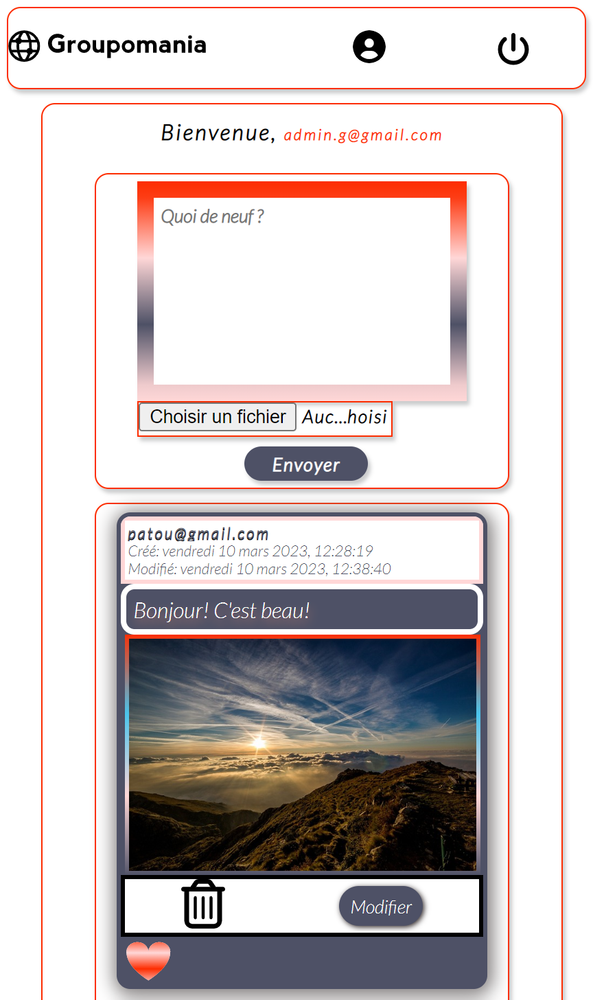
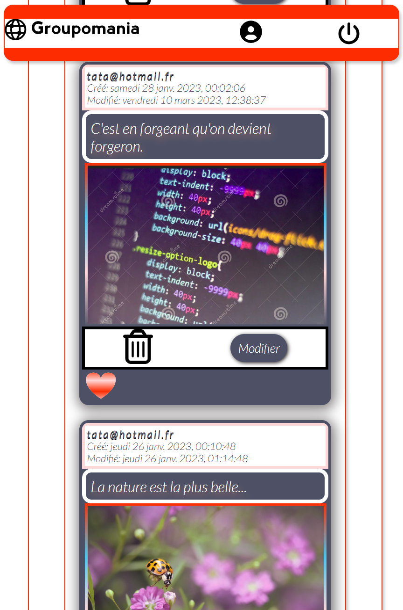

# Groupomania

[](#)

### *Contexte du projet*
~~~~
Le projet consiste à construire un réseau social interne pour les employés de Groupomania. 
Le but de cet outil est de faciliter les interactions entre collègues. Le département RH de
Groupomania a imaginé plusieurs fonctionnalités pour favoriser les échanges entre collègues.
~~~~
**_J'ai carte blanche pour le design_**.

### Mission

Détails du projet pour le back-end et le front-end

```
1. Page de connexion:
   =================
Une page de connexion permettant à l’utilisateur de se connecter, ou bien  de créer un compte s’il n’en possède pas.
la connexion doit se faire à partir de deux éléments : le mail de l’employé, et un mot de passe.

* Détails de la fonctionnalité de connexion:
    ● Un utilisateur doit avoir la possibilité de se déconnecter.
    ● La session de l’utilisateur persiste pendant qu’il est connecté.
    ● Les données de connexion doivent être sécurisées.

2. Page d’accueil:
   ==============
La page d’accueil doit lister les posts créés par les différents utilisateurs.
On voudra que les posts soient listés de façon antéchronologique (du plus
récent au plus ancien).

3. Création d’un post:
   ==================
● Un utilisateur doit pouvoir créer un post.
● Un post doit pouvoir contenir du texte et une image.
● Un utilisateur doit aussi pouvoir modifier et supprimer ses posts.

4. Système de like:
   ===============
Un utilisateur doit pouvoir liker un post, une seule fois pour chaque post.

5. Rôle administrateur:
   ===================
Dans le but de pouvoir faire de la modération si nécessaire, il faudra créer
un utilisateur “administrateur” ; celui-ci aura les droits de modification et
suppression sur tous les posts du réseau social.

```
_Chaque partie contient un README.md avec les détails techniques pour la configuration_.

### Aperçu

#### Page d'accueil mobile
[](#)

#### Page d'accueil mobile option scroll
[](#)